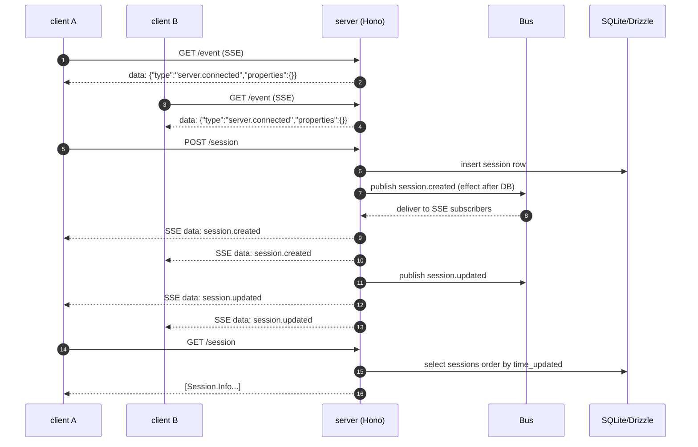
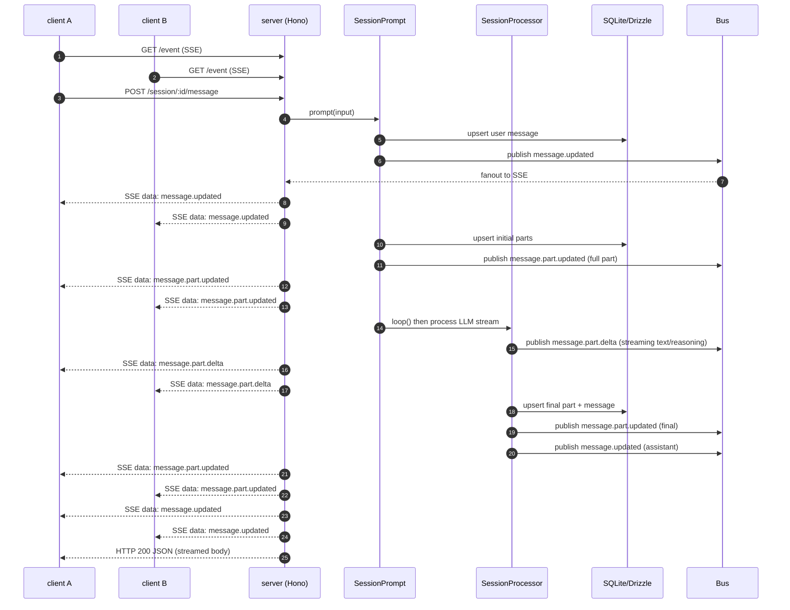
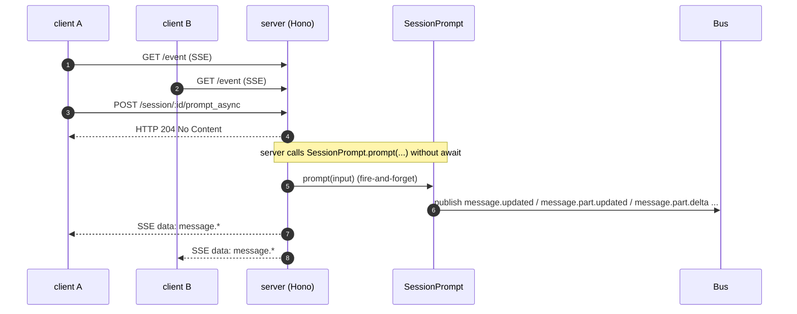
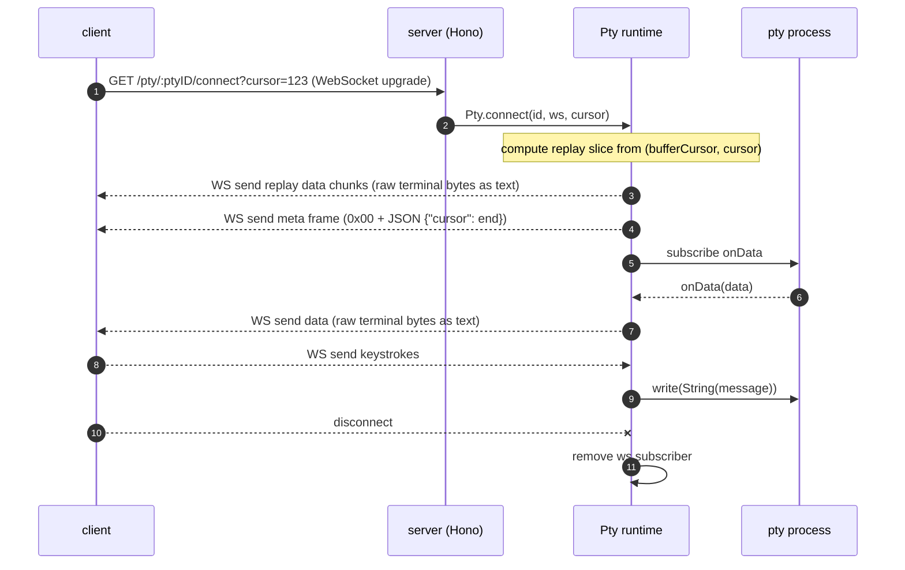

# Session management

How state persists and stays in sync

---

## Orient yourself

This doc explains how one running backend instance keeps multiple clients consistent while sessions, messages, and parts are being created and updated.

For deeper event-contract details, also read `docs/event-mechanism.md` and treat this page as the architecture view.

---

## Map the data

Persistent state lives in SQLite via Drizzle, centered on three tables: `session`, `message`, and `part`.

Schema definitions are in `packages/opencode/src/session/session.sql.ts` and use cascading deletes so removing a session removes its messages and parts.

- `session` rows hold metadata like `title`, `directory`, `share_url`, `permission`, summary fields, and timestamps (see `SessionTable` in `packages/opencode/src/session/session.sql.ts`).
- `message` rows store `MessageV2.Info` (minus ids) as JSON in `MessageTable.data` (see `packages/opencode/src/session/session.sql.ts` and `packages/opencode/src/session/message-v2.ts`).
- `part` rows store `MessageV2.Part` (minus ids) as JSON in `PartTable.data` (see `packages/opencode/src/session/session.sql.ts` and the part union in `packages/opencode/src/session/message-v2.ts`).

Message history reads are paged and ordered by `time_created` descending, then reversed back to chronological order for API responses (see `MessageV2.stream` and `Session.messages` in `packages/opencode/src/session/message-v2.ts` and `packages/opencode/src/session/index.ts`).

---

## Persist changes

Database access is wrapped by `Database.use(...)` and `Database.transaction(...)` and uses a simple "effects" queue for post-write side effects like event publishing (see `packages/opencode/src/storage/db.ts`).

Most writes follow this pattern:

1. write to DB inside `Database.use(...)`
2. schedule `Bus.publish(...)` via `Database.effect(...)`
3. let `Database.use(...)` flush effects after the DB call completes

You can see this directly in `Session.touch`, `Session.updateMessage`, and `Session.updatePart` in `packages/opencode/src/session/index.ts`.

Two important persistence details for client consistency:

- `Session.updatePartDelta(...)` only publishes an event and does not write to DB (see `Session.updatePartDelta` in `packages/opencode/src/session/index.ts`).
- Full part snapshots are persisted via `Session.updatePart(...)` and emitted as `message.part.updated` (see `MessageV2.Event.PartUpdated` in `packages/opencode/src/session/message-v2.ts` and `Session.updatePart` in `packages/opencode/src/session/index.ts`).

---

## Publish events

Events are typed at definition time using `BusEvent.define(type, zodSchema)` and registered into a process-wide registry (see `packages/opencode/src/bus/bus-event.ts`).

That registry is later materialized into a `discriminatedUnion("type", ...)` for OpenAPI and SDK typing via `BusEvent.payloads()` (see `packages/opencode/src/bus/bus-event.ts` and its use in `packages/opencode/src/server/server.ts` and `packages/opencode/src/server/routes/global.ts`).

Instance-scoped publishing is in `packages/opencode/src/bus/index.ts`:

- `Bus.publish(def, properties)` delivers to in-process subscribers for the current directory instance.
- The same call forwards `{ directory, payload }` onto the process-wide `GlobalBus` (a Node `EventEmitter`) for cross-directory fanout (see `packages/opencode/src/bus/global.ts`).

Session- and message-related event types are defined in:

- `packages/opencode/src/session/index.ts` (`session.created`, `session.updated`, `session.deleted`, `session.diff`, `session.error`)
- `packages/opencode/src/session/message-v2.ts` (`message.updated`, `message.part.updated`, `message.part.delta`, `message.part.removed`, `message.removed`)

PTY lifecycle event types are defined in `packages/opencode/src/pty/index.ts` (`pty.created`, `pty.updated`, `pty.exited`, `pty.deleted`).

---

## Stream updates

Same-instance multi-client fanout is done via Server-Sent Events on `GET /event` (see `packages/opencode/src/server/server.ts`).

Each connected client gets:

- an initial `server.connected` event written immediately on connect
- a best-effort stream of all bus events via `Bus.subscribeAll(...)`
- periodic `server.heartbeat` events every 10 seconds to keep proxies from stalling long-lived streams

The SSE handler explicitly unsubscribes on disconnect via `stream.onAbort(...)` (see `packages/opencode/src/server/server.ts`).

Instance disposal is treated as a hard boundary:

- the bus defines `server.instance.disposed` (see `Bus.InstanceDisposed` in `packages/opencode/src/bus/index.ts`)
- the SSE handler closes the stream when it sees that event type (see `packages/opencode/src/server/server.ts`)

Cross-directory/global routing exists for context, but is a separate stream:

- `Bus.publish(...)` forwards to `GlobalBus.emit("event", { directory, payload })` (see `packages/opencode/src/bus/index.ts`)
- `GET /global/event` exposes that global stream over SSE (see `packages/opencode/src/server/routes/global.ts` and `packages/opencode/src/bus/global.ts`)

---

## Trace flows

### Create and list + fanout

Evidence pointers: session routes in `packages/opencode/src/server/routes/session.ts`, persistence + events in `packages/opencode/src/session/index.ts`, SSE fanout in `packages/opencode/src/server/server.ts`, and bus behavior in `packages/opencode/src/bus/index.ts`.

### Prompt sync + multi-client updates

Evidence pointers: `POST /session/:sessionID/message` in `packages/opencode/src/server/routes/session.ts`, message/part persistence + events in `packages/opencode/src/session/index.ts` and `packages/opencode/src/session/message-v2.ts`, and SSE plumbing in `packages/opencode/src/server/server.ts`.

### Prompt async + 204 + results via SSE

Evidence pointer: `POST /session/:sessionID/prompt_async` explicitly does not `await SessionPrompt.prompt(...)` (see `packages/opencode/src/server/routes/session.ts`), while the prompt pipeline emits bus events (see `packages/opencode/src/session/prompt.ts` and event definitions in `packages/opencode/src/session/message-v2.ts`).

### PTY connect + replay buffer + bytes vs control frames

Evidence pointers: replay buffer, cursor math, and control frame format in `packages/opencode/src/pty/index.ts`, and the WebSocket upgrade endpoint in `packages/opencode/src/server/routes/pty.ts`.

---

## Reconcile in web

The web app treats REST as the source of truth and SSE as incremental updates.

Bootstrapping loads a directory-scoped snapshot (project, providers, config, session list, statuses, and other caches) using REST calls and then marks the store as complete (see `bootstrapDirectory(...)` in `packages/app/src/context/global-sync/bootstrap.ts`).

Event application is a pure "merge into store" reducer keyed by `event.type`, using stable insertion via binary search and Solid `reconcile(...)` to minimize churn (see `applyDirectoryEvent(...)` and `applyGlobalEvent(...)` in `packages/app/src/context/global-sync/event-reducer.ts`).

Streaming deltas are handled as an optimization:

- `message.part.updated` replaces or inserts the full part object (see `case "message.part.updated"` in `packages/app/src/context/global-sync/event-reducer.ts`).
- `message.part.delta` appends to an existing in-memory part field and is ignored if the part is missing (see `case "message.part.delta"` in `packages/app/src/context/global-sync/event-reducer.ts`).

Practical implication is that clients must be willing to re-fetch state after reconnects or suspected gaps, because missing a base `part.updated` makes later deltas unusable.

---

## Bridge terminals

PTYs are intentionally not persisted like sessions and messages.

A PTY is an in-memory per-instance object with a replay buffer and a subscriber set, and it is cleaned up when the instance is disposed (see `Instance.state(...)` usage in `packages/opencode/src/pty/index.ts`).

PTY output fanout is multi-client, but it is byte-oriented:

- `ptyProcess.onData(...)` forwards raw data to every connected WebSocket subscriber (see `packages/opencode/src/pty/index.ts`).
- The replay buffer is capped (`BUFFER_LIMIT`) and tracked by a logical cursor so reconnecting clients can request "from cursor N" or "tail" (`cursor=-1`) (see `connect(...)` in `packages/opencode/src/pty/index.ts`).

PTY lifecycle is still visible to all clients via typed SSE events (`pty.created`, `pty.updated`, `pty.exited`, `pty.deleted`) even though the terminal bytes are on WebSocket (see `packages/opencode/src/pty/index.ts` and `GET /event` in `packages/opencode/src/server/server.ts`).

---

## Answer questions

### Why SSE for events vs WebSocket

SSE is used for the general event stream because it is server-to-client, structured, and naturally fits the "subscribe and react" pattern without requiring bidirectional framing.

You can see this choice in the API surface itself: events are exposed as `GET /event` using `streamSSE(...)` and `Bus.subscribeAll(...)`, plus heartbeats for proxy stability (see `packages/opencode/src/server/server.ts`).

### Why PTY uses WebSocket

PTY needs bidirectional, low-latency transport and carries raw terminal output plus user keystrokes, which SSE cannot do.

The code path is explicitly bidirectional: `Pty.connect(...)` returns an `onMessage` handler that writes to the PTY process, and PTY `onData` pushes bytes back to all WebSocket subscribers (see `packages/opencode/src/pty/index.ts` and `packages/opencode/src/server/routes/pty.ts`).

### Ordering and consistency guarantees

What is guaranteed (same process, same instance):

- Per-connection SSE write order follows the order `Bus.publish(...)` invokes subscriber callbacks, because the SSE handler writes each received event sequentially (see `Bus.publish(...)` in `packages/opencode/src/bus/index.ts` and the `Bus.subscribeAll(...)` callback in `packages/opencode/src/server/server.ts`).
- Persistent reads can reconstruct a coherent snapshot because messages and parts are stored in SQLite and retrieved deterministically (see `MessageV2.stream(...)` in `packages/opencode/src/session/message-v2.ts` and schema in `packages/opencode/src/session/session.sql.ts`).

What is best-effort:

- SSE delivery has no built-in replay cursor or event id in this implementation, so reconnects can miss events that occurred while disconnected (see `GET /event` in `packages/opencode/src/server/server.ts`).
- `message.part.delta` is ephemeral and not written to DB, so it should be treated as "nice to have" streaming UX rather than correctness (see `Session.updatePartDelta(...)` in `packages/opencode/src/session/index.ts`).

What clients must do to recover:

- Re-bootstrap from REST when the SSE stream reconnects or when a gap is suspected, because REST is the durable source of truth (see bootstrapping in `packages/app/src/context/global-sync/bootstrap.ts`).
- Prefer applying `message.part.updated` over relying on deltas, and tolerate missing deltas by using later full-part updates or re-fetching the message list (`GET /session/:id/message` in `packages/opencode/src/server/routes/session.ts`).

PTY has a stronger reconnect story:

- Clients can replay terminal output from a cursor using `?cursor=` and a bounded server-side replay buffer (see `connect(...)` in `packages/opencode/src/pty/index.ts` and the cursor parsing in `packages/opencode/src/server/routes/pty.ts`).

### Multi-client semantics

How fanout works:

- Each SSE connection registers its own `Bus.subscribeAll(...)` callback, so a single `Bus.publish(...)` results in one event delivery per connected client (see `packages/opencode/src/server/server.ts` and `packages/opencode/src/bus/index.ts`).
- PTY fanout is a subscriber map per PTY id, and each `onData` iterates current subscribers and best-effort sends bytes (see `packages/opencode/src/pty/index.ts`).

What happens on disconnect:

- SSE: `stream.onAbort(...)` clears the heartbeat timer and unsubscribes the bus callback, so the server stops tracking that client immediately (see `packages/opencode/src/server/server.ts`).
- PTY: `onClose` removes the socket from the subscriber map and the server stops sending bytes (see `packages/opencode/src/pty/index.ts`).

What happens with missed events:

- SSE: missed events are not replayed by the transport, so clients must re-fetch state (see `GET /event` implementation in `packages/opencode/src/server/server.ts` and the REST list/get routes in `packages/opencode/src/server/routes/session.ts`).
- Web app reducer drops deltas when it cannot find a base part, which is correct-but-incomplete behavior unless followed by a refresh (see `case "message.part.delta"` in `packages/app/src/context/global-sync/event-reducer.ts`).

What happens on disposal:

- Instance disposal triggers `server.instance.disposed` and the SSE stream closes when that event is observed (see `Bus.InstanceDisposed` in `packages/opencode/src/bus/index.ts` and the close condition in `packages/opencode/src/server/server.ts`).
- Global disposal emits a global-scoped event and is surfaced on `GET /global/event` (see `packages/opencode/src/server/routes/global.ts` and `packages/opencode/src/bus/global.ts`).

---

## Append and extend

### Appendix: Build a WS or gRPC gateway

A gateway can treat REST as commands and SSE as the event source of truth.

WS gateway sketch (thin proxy):

- Client opens `wss://gateway/events?directory=...`.
- Gateway opens SSE `GET /event` (or `GET /global/event`) upstream and forwards each `{ type, properties }` JSON blob over WS.
- Client-to-server actions (create session, prompt, update title) remain REST calls, or you can add WS messages that the gateway maps to those REST endpoints.

gRPC gateway sketch (typed streams):

- Define `rpc SubscribeEvents(SubscribeRequest) returns (stream Event)` and map it to upstream SSE `GET /event`.
- Define unary RPCs that mirror existing REST endpoints (`CreateSession`, `ListSessions`, `PostMessage`, `PostPromptAsync`) and implement them by calling the existing HTTP API.

Keep these constraints in mind:

- SSE in this repo has no event replay id, so your gateway must either accept best-effort streaming or add its own buffering and resume tokens.
- PTY cannot be represented well as typed SSE events, so keep it as a raw byte stream over WS (or gRPC bidi streaming) and reuse the existing `cursor` replay contract (see `packages/opencode/src/pty/index.ts` and `packages/opencode/src/server/routes/pty.ts`).
